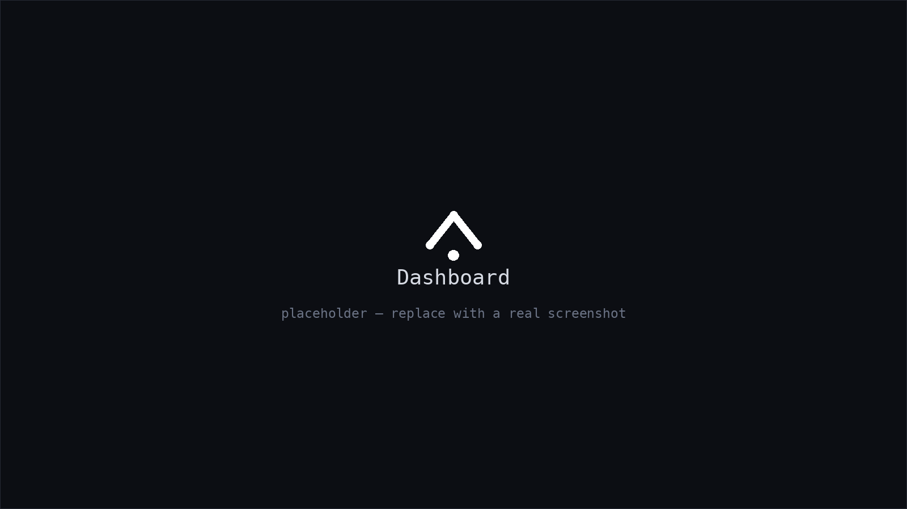
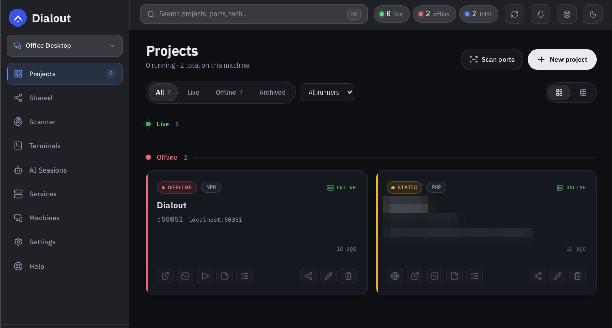
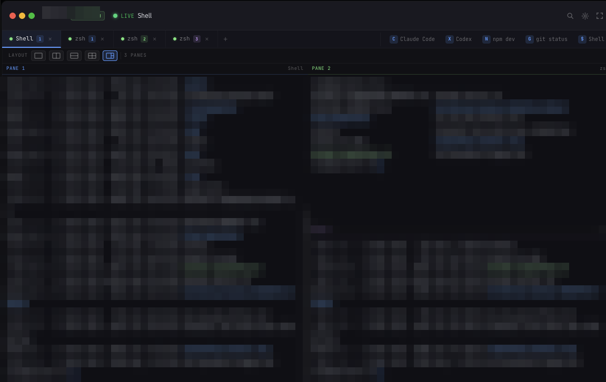
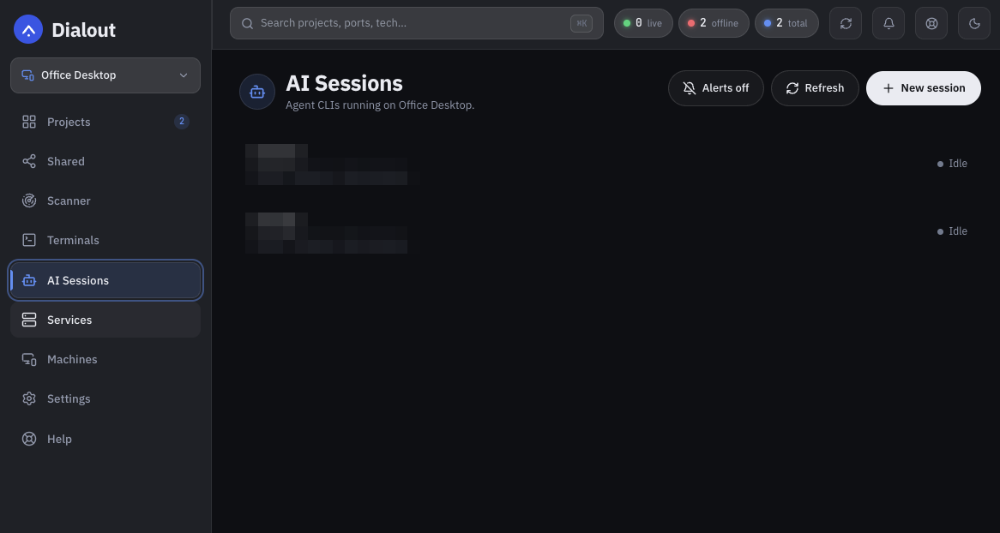
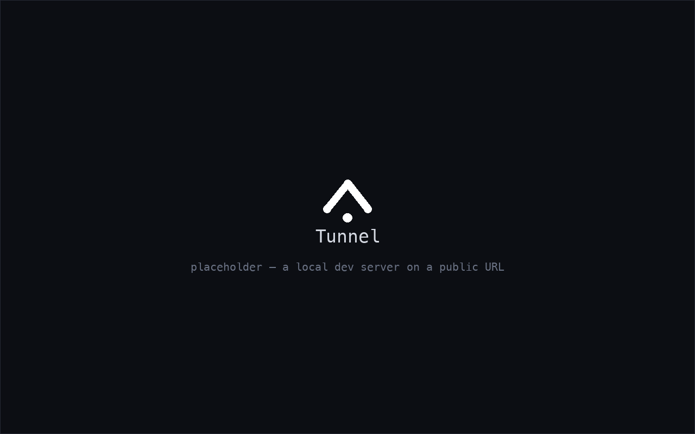
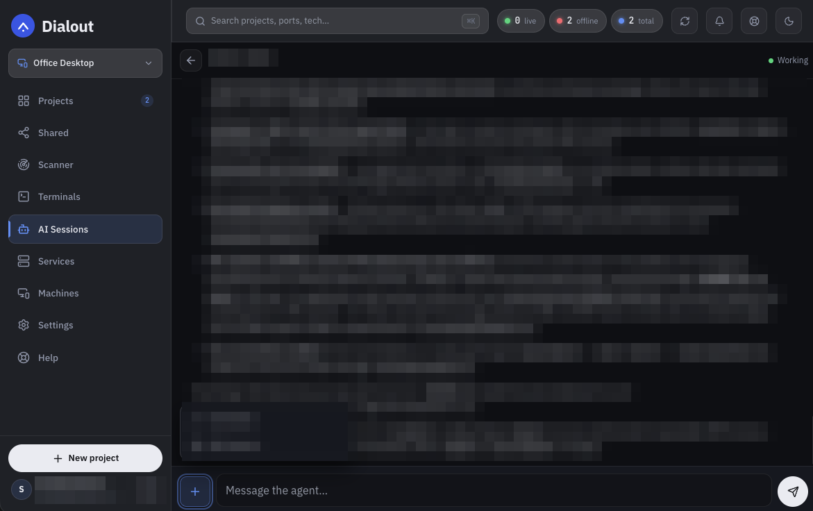
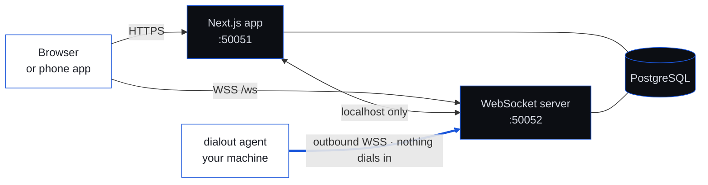
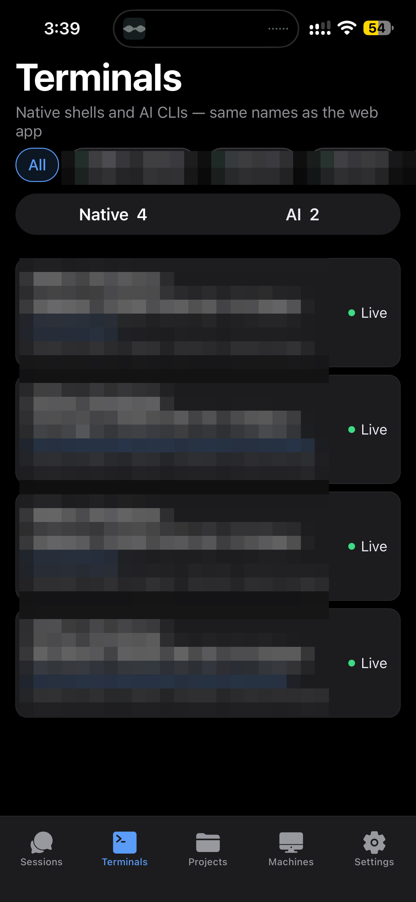

<div align="center">


# Dialout

**Your machines, one room. The agent dials out, so nothing has to dial in.**

[](LICENSE)
[](https://www.npmjs.com/package/@indianic/dialout)
[](package.json)
[](packages/devdash-agent)
[](#self-hosting)

**[Website](https://www.dialout.dev)** · [Get started](#getting-started) · [How it works](#how-it-works) · [FAQ](#faq) · [Security](SECURITY.md)

</div>

---

**Dialout is a free, open-source, self-hosted remote development dashboard.** It
gives you one private URL from which you can reach every computer you code on —
your office desktop, your home machine, a build box, a Raspberry Pi — from any
browser or your phone. From that one place you can see which ports are live,
open a real terminal, browse the filesystem, start and stop processes, put a
`localhost` dev server on a public URL, and read and reply to your Claude Code,
Codex and Grok sessions as chat.

A small agent on each machine connects **outbound** to your server. There is no
inbound port to open, no VPN to join, and no port forwarding to configure.



<sub>_Screenshot placeholder — see [docs/assets/screenshots](docs/assets/screenshots)._</sub>

---

## The problem

You are away from your desk and you need to know what your machine is doing.
Today that means being at the machine, or reassembling the answer by hand:

```console
$ lsof -i :3000                 # which project is this, again?
node  41287  you  26u  IPv6  TCP *:3000 (LISTEN)

$ ssh build-box                 # the other four ports are on a different box
you@build-box:~$ pm2 list
you@build-box:~$ cat apps/checkout/.env | grep STRIPE_

$ tmux ls                       # and the migration I started on Friday?
0: 1 windows  1: 1 windows      # no idea which one
```

Four terminals, three machines, and the only index is your memory. Then it gets
worse over time. Run six projects for a year and *"which port was the admin
panel on?"* becomes a genuinely hard question — one that nothing in your
toolchain is keeping the answer to.

Meanwhile an AI coding agent is running a 40-minute task on that machine and
will sit and wait for an answer the moment you walk away from it.

## What Dialout does about it

One URL. Every machine. From a phone if that is what you have on you.

```console
$ npm install -g @indianic/dialout && dialout init
```

- **Search a port, keep the answer.** Scan a range, find what is listening, save
  it as a project. `:3000` stops being a mystery and starts being *Checkout,
  on the office Mac, running.*
- **See what is actually up.** Every dashboard load live-checks every port —
  batched through the agent when the machine is online, an 800 ms TCP probe
  when it is not.
- **Open a real terminal, from anywhere.** SSH-grade access to any machine, and
  it opens straight into the project folder.
- **Answer your AI agent from your phone.** Claude Code, Codex and Grok
  sessions across every machine, rendered as chat, with a push notification
  when one is waiting on you.
- **Share a project with a teammate.** Read-only, with comments, notes and
  todos attached to the project instead of to a chat thread.
- **Put `localhost` on a public URL.** For a client demo, a webhook, or a phone
  you are testing on.

> [!NOTE]
> Dialout came out of a real problem rather than a product plan. Its author
> wanted to keep working from anywhere — reading progress, answering an AI
> agent mid-task, checking whether the thing he started this morning is still
> running — without carrying the machine along. See
> [Who built this](#who-built-this).

---

## See it

<table>
<tr>
<td width="50%"><br><sub><b>Projects.</b> Ports, stack, notes, todos and credentials — per machine, live-checked.</sub></td>
<td width="50%"><br><sub><b>Terminals.</b> Real tmux. Close the tab, the build keeps running.</sub></td>
</tr>
<tr>
<td width="50%"><br><sub><b>AI sessions.</b> Three vendors, one chat surface, every machine.</sub></td>
<td width="50%"><br><sub><b>Tunnel.</b> Any local port on a public URL, rewritten so the app still works.</sub></td>
</tr>
</table>

**Demo video**

<a href="https://www.dialout.dev/demo"></a>

<sub>_All images above are placeholders. Drop real files into
[`docs/assets/screenshots/`](docs/assets/screenshots) under the same names and
they appear here and on npm — no markup changes needed._</sub>

---

## The four things nothing else does together

**1 · The agent dials out.** No inbound port on the developer machine, no VPN,
no firewall rule. A laptop on hotel Wi-Fi is as reachable as a rack server.

**2 · Terminals are real tmux, not a web shell.** Close the browser and the
build keeps running. Reattach from your phone. Open a terminal *natively* and
join the same session — the agent writes a guarded block into your shell rc so
it just happens. A dropped socket detaches rather than kills; the PTY is held
for 10 minutes so a reconnect resumes exactly where you were.

**3 · AI sessions read as chat, and it never scrapes the TUI.** Claude Code,
Codex and Grok each already write a structured JSONL transcript. The agent
tails that file and normalises all three into one event type. Scraping the
alternate-screen terminal UI would break on every upstream release; this does
not.

**4 · The tunnel rewrites the app so it survives a path prefix.** Absolute
`/_next/` and `/api/` paths are rewritten in HTML, JS and CSS, and an injected
script patches `fetch`, `XMLHttpRequest`, `history.pushState`, anchor clicks and
the Navigation API. That is why a real Next.js or PHP app works through it
rather than half-loading.

---

## How it works



Three processes, and the direction of that last arrow is the whole design.

| Process | Job |
| --- | --- |
| **Next.js app** | UI and REST API. Holds sessions, database writes and authorization. Never talks to an agent directly. |
| **ws-server** | The only process holding agent sockets. Binds `127.0.0.1` by default — its relay endpoints are remote command execution if they are reachable. |
| **dialout agent** | Runs on your machine, dials out, holds the socket open. macOS and Linux. |

Read [how it works](https://www.dialout.dev/how-it-works) for the long version.

---

## Getting started

Six steps, about ten minutes. You need a Dialout **server** (one, shared by all
your machines) and the **agent** on each machine you want to reach.

### 1 · Get a server

Pick one. Both give you the same product.

<table>
<tr>
<td width="50%">

**Self-host it** — the main path

```bash
git clone https://github.com/indianic/dialout.git
cd dialout && npm install
createdb dialout
cp .env.example .env   # DATABASE_URL + JWT_SECRET
npm run db:push        # creates the schema
npm run dev            # localhost:50051
```

Your data lives in your PostgreSQL, on your infrastructure. Node 18+, Postgres,
and a reverse proxy that forwards a WebSocket upgrade.

</td>
<td width="50%">

**Try it on [dialout.dev](https://www.dialout.dev)** — no setup

Create an account on the public instance if you want to look around before
committing to hosting it yourself.

It runs the same code that is in this repository, with nothing added and nothing
held back. Move to your own server whenever you like — the agent is repointed
with one command.

</td>
</tr>
</table>

### 2 · Create your account

Open your server (`http://localhost:50051`, or
[www.dialout.dev](https://www.dialout.dev)) and **sign up** with your email.

You will then be walked through **two-factor enrolment** — scan the QR code with
any TOTP app. This is not optional and not skippable: the API enforces it
independently of the interface, because this is a tool that opens terminals on
your machines.

### 3 · Add a machine and generate its key

In the dashboard go to **Settings → Machines → Add machine**, give it a name you
will recognise (`office-mac`, `home-desktop`, `build-box`), then click
**Generate key**.

You get an `mch_…` key. **Copy it now — it is shown once and stored only as a
hash.** Generate a new one any time if you lose it.

### 4 · Install the agent on that machine

On the computer you just registered:

```bash
npm install -g @indianic/dialout
```

macOS or Linux, Node 18 or newer. Nothing else to install.

### 5 · Point it at your server

```bash
dialout init
```

It asks for two things:

| Prompt | What to paste |
| --- | --- |
| **Server URL** | The WebSocket base — `wss://www.dialout.dev/ws`, or `ws://localhost:50052` for a local server. The agent appends `/daemon` itself. |
| **API key** | The `mch_…` key from step 3 |

`init` then offers to install the OS service. Choose **at boot** if you want the
machine reachable before anyone logs into the desktop — on a machine you are
trying to reach remotely, that is almost always what you want.

### 6 · Start it and check

```bash
dialout status
```

```
Dialout Agent Status
────────────────────────────────────────────
  Server:    wss://www.dialout.dev/ws
  API Key:   ****K27F
  Config:    /Users/you/.dialout/config.json
  Service:   installed (launchd, at boot)
  Process:   running (PID: 12345, managed by launchd)
────────────────────────────────────────────
```

The machine turns green in the dashboard and its ports go live. Repeat steps 3
to 6 for every other machine you want in the room.

**Full walkthrough:**
[dialout.dev/docs/installation](https://www.dialout.dev/docs/installation) ·
**Agent CLI reference:** [`packages/devdash-agent`](packages/devdash-agent#cli-reference)

---

## Mobile app

<table>
<tr>
<td width="62%">

### iOS and Android — coming soon

Native builds for iPhone, iPad and Android are in preparation for the App Store
and Google Play. They cover the cases that matter when you are not at a desk:

- Read and answer an AI session from the lock screen notification
- A real terminal with a key-chip bar for the keys a soft keyboard does not have
- Project list with live port status
- Credentials behind Face ID / biometric unlock

Until then the web app is an installable PWA — **Add to Home Screen** gives you
an icon, offline chrome and push notifications on both platforms today.

**[Get notified when it ships →](https://www.dialout.dev/contact)**

</td>
<td width="38%"></td>
</tr>
</table>

---

## Everything else it does

<details>
<summary><b>Projects</b> — ports, discovery, process control, sharing</summary>

<br>

| | |
| --- | --- |
| **Live port checks** | Every dashboard load checks every port. Batched through the agent when it is online; an 800 ms TCP probe when it is not. Port-less URL projects are checked through the tunnel. |
| **Multi-machine projects** | One project mapped onto several machines with per-machine port and root-path overrides. |
| **Process control** | Start, stop and restart from the browser or phone, using quick-launch commands you saved per project. |
| **Notes and todos** | Per project, so context travels with the project instead of living in your head. |
| **Credentials vault** | AES-256-GCM at rest. Never returned by list endpoints — only by an explicit reveal route. |
| **Sharing** | Read-only access for a teammate, with comments and an optional terminal grant. Non-owners never get edit paths. |
| **Discovery** | Scan a port range to find what is running; scan a folder tree to find projects you never registered. |

</details>

<details>
<summary><b>Terminals</b> — tmux, cowork, recording, phone</summary>

<br>

| | |
| --- | --- |
| **tmux-backed** | Survives browser reloads, network drops and app switches. |
| **Cowork** | Your native terminal and the browser attach to the same session. |
| **Resumable by name** | Session names are deterministic, so reopening attaches instead of creating a duplicate. |
| **Recording and playback** | Sessions record to chunks and replay at `/sessions/<id>`, purged on a per-user retention policy. |
| **Local vs Web** | The registry separates sessions you started natively from ones the browser opened. |
| **Phone terminal** | A real terminal on the phone, with a key-chip bar for Esc, Tab, Ctrl and the arrows. |

</details>

<details>
<summary><b>AI sessions</b> — Claude Code, Codex, Grok</summary>

<br>

| | |
| --- | --- |
| **Three vendors** | Each with its own transcript layout and working-directory escaping scheme, all normalised to one event type. |
| **Every machine, one list** | See which agents are working, waiting, or idle across the whole fleet. |
| **Launch mode** | Start a new session from the phone. Each message runs one turn and exits, so an agent restart loses nothing — the transcript is the state. |
| **Push when it needs you** | A notification fires only on working → waiting, with a two-minute cooldown, and never on a first sighting. |

</details>

<details>
<summary><b>Infrastructure and account</b></summary>

<br>

| | |
| --- | --- |
| **HTTP tunnel** | Any local port, or a named vhost for PHP and static sites, on a public URL. 10 MB body cap, styled pages for "machine offline" and "server not running". |
| **File browser** | Browse any machine's filesystem from the dashboard. |
| **Services registry** | Track the long-running services that are not projects. |
| **Machines and API keys** | Each machine enrols with an `mch_…` key, SHA-256 compared server-side. |
| **PIN + mandatory TOTP** | Two-factor enforced at the API layer, not just in the UI. |
| **Native and browser sessions** | One JWT — an HttpOnly cookie for browsers, a bearer token for native clients. Page scripts can never read the token. |
| **Web push** | Notifications for shares, comments, and AI sessions that need you. |
| **Themes** | Light and dark, contrast-measured. |

</details>

---

## FAQ

### What is Dialout?

A self-hosted development control room. It tracks every project on every machine
you own — ports, stack, notes, todos, credentials — live-checks what is running,
and gives you remote terminals, a file browser, process control, an HTTP tunnel
and your AI coding sessions, from one URL on any device.

### How do I access my office or home computer from anywhere?

Install the agent on that computer and point it at your Dialout server. The
agent connects outbound and holds the socket open, so the machine is reachable
from your dashboard without opening any inbound port, joining a VPN, or setting
up port forwarding on the router.

### Is Dialout free and open source?

Yes — MIT licensed, and designed to be self-hosted. There is no paid tier and
no feature held back for one. [www.dialout.dev](https://www.dialout.dev) runs
this same code as a public instance you can sign up to if you want to look
around first, but the intended home for it is your own server.

### Do I have to open a port or set up a VPN?

No. That is the core design decision. The agent dials *out*. If the machine can
reach the internet, you can reach the machine.

### Can I use it with Claude Code, Codex or Grok?

Yes. Dialout reads the structured JSONL transcript each CLI already writes and
renders the session as chat, so you can follow progress and answer a prompt from
your phone. It does not scrape the terminal UI, which is why an upstream release
does not break it.

### Which operating systems does the agent support?

macOS and Linux, Node 18 or newer. The server runs anywhere Node and PostgreSQL
run. The dashboard works in any modern browser, including mobile.

### Is there a mobile app?

Native iOS and Android apps are coming soon. Today the web app installs as a PWA
with push notifications on both platforms.

### Where does my data live?

In your PostgreSQL database, on your server. Nothing is sent anywhere else.
Secrets are encrypted at rest with AES-256-GCM.

### How is this different from a VPN, a tunnel service, or an IDE remote extension?

A mesh VPN solves the network and leaves you to assemble the dashboard,
terminals and previews. A tunnel service gives you a public URL and nothing
else. A remote-development extension ties you to one editor and one machine at a
time. Dialout's claim is that the combination is the product, and that the
outbound-only agent is what makes the combination cheap to run.

---

## Self-hosting

One PostgreSQL database, one Node process, one WebSocket process. Your data
lives in your database, on your infrastructure, and is never sent anywhere
else.

Read **[SECURITY.md](SECURITY.md)** before you point a real machine at it. It
documents the auth model, the per-route authorization rules, and the two
settings that matter most when the thing faces the internet.

## What is in this repository

| Path | What it is |
| --- | --- |
| `src/app/(dash)` | The dashboard |
| `src/app/(marketing)` | The public site at www.dialout.dev |
| `src/app/api` | 40 routes — every one authenticated, every client-supplied id authorized |
| `src/ws-server` | The WebSocket process, 1,753 lines, single file |
| `src/lib/schema.ts` | 20 tables, Drizzle ORM |
| `packages/devdash-agent` | The CLI agent, published as [`@indianic/dialout`](https://www.npmjs.com/package/@indianic/dialout) — 19 commands, macOS and Linux |
| `packages/devdash-shared` | Types shared by server, agent and mobile |
| `packages/devdash-mobile` | The Expo app |

## Changelog

[CHANGELOG.md](CHANGELOG.md) for the server and dashboard;
[the agent keeps its own](packages/devdash-agent/CHANGELOG.md), because it is
versioned and published separately.

## Contributing

[CONTRIBUTING.md](CONTRIBUTING.md) is short on ceremony and long on the specific
things that will get a pull request sent back — the ones you cannot guess by
reading the code. Bug reports and feature requests go in
[Issues](https://github.com/indianic/dialout/issues).

---

## Who built this

Dialout was designed and built by **[Sandeep Mundra](mailto:sandeep@indianic.com)**,
CTO of IndiaNIC, to solve a problem he had himself: continuing to work on his
office and home machines from wherever he happened to be, and from a phone.
Reading a project's progress, answering an AI coding agent mid-task, and finding
which port a project was on — without being in front of the machine.

<div align="center">
<br>
<sub>Sponsored and maintained by</sub><br><br>

### [IndiaNIC Infotech Ltd](https://www.indianic.com)

<sub>Engineering and product teams, since 1998 · Ahmedabad, India</sub>

<br>

[](https://www.indianic.com)
[](mailto:hello@indianic.com)

</div>

Dialout is free and MIT licensed, and always will be. If you want it customised
for your team, integrated with your stack, or deployed and run for you, that is
what IndiaNIC does — reach us at
**[hello@indianic.com](mailto:hello@indianic.com)** or
**[www.indianic.com](https://www.indianic.com)**.

## Licence

**MIT** — see [LICENSE](LICENSE). Copyright © 2026 IndiaNIC Infotech Ltd.

MIT was chosen deliberately over a copyleft or source-available licence. This is
infrastructure you run on your own machines, and the least useful thing a
licence can do here is make you check with a lawyer before deploying it inside a
company. So: use it commercially, modify it, fork it, run it for clients, embed
it in something you sell. Keep the copyright notice, and there is no warranty.
That is the whole of it.

The agent on npm ([`@indianic/dialout`](https://www.npmjs.com/package/@indianic/dialout))
and the shared types package are MIT on the same terms.
